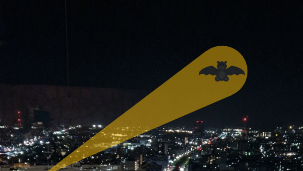
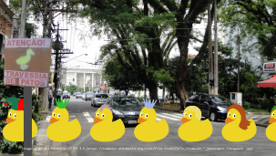

# The Great TikZlings Christmas Extravaganza 2024

This repository contains the souce code of the Great TikZlings Extravanganza 2024, brought to you by [Ulrike](https://github.com/u-fischer) & [Gert Fischer](https://github.com/g-fischer), [Carla Maggi](https://github.com/CarLaTeX), [Paulo Cereda](https://github.com/cereda) and [samcarter](https://github.com/samcarter).

The full video is available from ...

## 1. Flower power

- Music: San Francisco - Scott McKenzie 
  https://www.youtube.com/watch?v=bch1_Ep5M1s
  
- Image: Golden Gate Bridge San Francisco - crispy-fotografie
  https://pixabay.com/de/photos/golden-gate-bridge-san-francisco-4271364/

- Source Code: [./samcarter/flowerpower/](https://github.com/TikZlings/Extravaganza2024/tree/main/samcarter/flowerpower)

## 2. Bat Bär

- Music: The Batman Theme
  https://www.youtube.com/watch?v=lcCYhDu4_ZY
  
- Image: Ulrike & Gert Fischer

- Source Code: [./samcarter/batbear/](https://github.com/TikZlings/Extravaganza2024/tree/main/samcarter/batbear)

## 3. unstoppable

- Music: The Bridge on the River Kwai (1957) - Colonel Bogey March
  https://www.youtube.com/watch?v=dzWRlTgEB5Q
  
- Image: Praça vilaboim - Pedro Medeiros
  https://commons.wikimedia.org/wiki/File:Pra%C3%A7a_vilaboim_-_panoramio_(cropped).jpg

- Source Code: [./samcarter/batbear/](https://github.com/TikZlings/Extravaganza2024/tree/main/samcarter/unstoppable)

## 4. Abbey Road

- Music: Here Comes The Sun - The Beatles
  https://www.youtube.com/watch?v=xUNqsfFUwhY
  
- Image: Abbey Road zebra crossing - m.caimary
  https://en.wikipedia.org/wiki/File:Abbey_Road_zebra_crossing,_London_2007-03-31.jpg

- Source Code: [./samcarter/abbeyroad/](https://github.com/TikZlings/Extravaganza2024/tree/main/samcarter/abbeyroad)

## 5. White Water Ride

- Music: Swan Lake - II. Dance of the Little Swans
  https://www.youtube.com/watch?v=EVSb3dFszH4&t=4s
  
- Background video: Hucklebarry 
  https://pixabay.com/videos/water-river-current-nature-outdoor-32558/

- Source Code: [./samcarter/whitewaterride/](https://github.com/TikZlings/Extravaganza2024/tree/main/samcarter/whitewaterride)

## 5. Paddington

- Music: The Adventure of Paddington - Marmalade Song
  https://www.youtube.com/watch?v=EHxUb5akz48
  
- Image: Jeff Hitchcock 
  https://en.wikipedia.org/wiki/File:Paddington_Station_GWR.jpg

- Source Code: [./samcarter/paddington/](https://github.com/TikZlings/Extravaganza2024/tree/main/samcarter/paddington)

## 6. Finale

- Music: Vangelis - Conquest of paradise
  https://www.youtube.com/watch?v=WYeDsa4Tw0c&t=5s
  
- Source Code: [./ulrike/finale/](https://github.com/TikZlings/Extravaganza2024/tree/main/ulrike/finale)